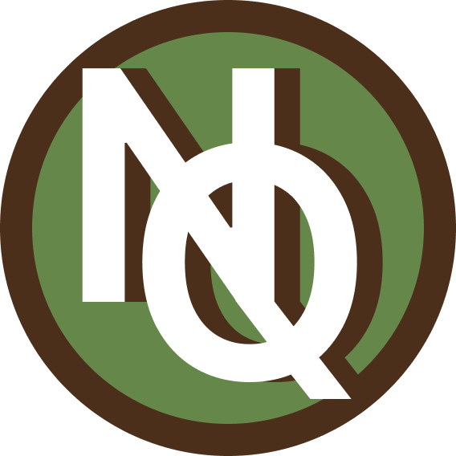

<!-- PROJECT LOGO -->
 

  

  <h3 align="center">NutriQuest</h3>

  

    Connect with others passionate about health and exercise. Dive into a community where you can post, comment, like, and share workout plans. Whether you're looking to exchange tips, or draw workout inspiration, this app is your go-to platform. Upcoming features include macro calculations with barcode and AI image scanning, a calorie unit conversion calculator, and a streamlined workout creation menu. 
     
     
     
  

<!-- TABLE OF CONTENTS -->

  
Table of Contents

  <ol>
    <li><a href="#about-the-project">About The Project</a></li>
    <li><a href="#built-with">Built With</a></li>
  </ol>

<!-- ABOUT THE PROJECT -->
## [About The Project]()

[![DashboardChat][product-screenshot-desktop]]()

(<a href="#readme-top">back to top</a>)

## [Built With]()

* [![React.js][React.js]][React-url]
* [![Firebase.com][Firebase.com]][Firebase-url]
* [![Next.js][Next.js]][Next-url]
* [![Bootstrap][Bootstrap.com]][Bootstrap-url]
* [![SASS.com][SASS.com]][SASS-url]

(<a href="#readme-top">back to top</a>)

<!-- MARKDOWN LINKS & IMAGES -->
<!-- https://www.markdownguide.org/basic-syntax/#reference-style-links -->
[issues-shield]: https://img.shields.io/github/issues/othneildrew/Best-README-Template.svg?style=for-the-badge
[issues-url]: https://github.com/othneildrew/Best-README-Template/issues
[license-shield]: https://img.shields.io/github/license/othneildrew/Best-README-Template.svg?style=for-the-badge
[license-url]: https://github.com/othneildrew/Best-README-Template/blob/master/LICENSE.txt
[linkedin-shield]: https://img.shields.io/badge/-LinkedIn-black.svg?style=for-the-badge&logo=linkedin&colorB=555
[linkedin-url]: https://linkedin.com/in/othneildrew
[product-screenshot-desktop]: src/assets/NutriQuestChat.PNG
[Svelte.dev]: https://img.shields.io/badge/Svelte-4A4A55?style=for-the-badge&logo=svelte&logoColor=FF3E00
[Svelte-url]: https://svelte.dev/
[Laravel.com]: https://img.shields.io/badge/Laravel-FF2D20?style=for-the-badge&logo=laravel&logoColor=white
[Laravel-url]: https://laravel.com

[Bootstrap.com]: https://img.shields.io/badge/Bootstrap-563D7C?style=for-the-badge&logo=bootstrap&logoColor=white
[Bootstrap-url]: https://getbootstrap.com
[Figma.com]: https://img.shields.io/badge/figma-%23F24E1E.svg?style=for-the-badge&logo=figma&logoColor=white
[Figma-url]: https://www.figma.com/
[JavaScript.js]: https://img.shields.io/badge/javascript-%23323330.svg?style=for-the-badge&logo=javascript&logoColor=%23F7DF1E
[JavaScript-url]: https://www.w3schools.com/Js/
[CSS3.css]: https://img.shields.io/badge/css3-%231572B6.svg?style=for-the-badge&logo=css3&logoColor=white
[CSS3-url]: https://www.w3schools.com/css/default.asp
[HTML5.html]: https://img.shields.io/badge/html5-%23E34F26.svg?style=for-the-badge&logo=html5&logoColor=white
[React.js]: https://img.shields.io/badge/react-black?style=for-the-badge&logo=react&logoColor=white
[React-url]: https://react.dev/
[Next.js]: https://img.shields.io/badge/next.js-000000?style=for-the-badge&logo=nextdotjs&logoColor=white
[Next-url]: https://nextjs.org/
[Firebase.com]: https://img.shields.io/badge/Firebase-039BE5?style=for-the-badge&logo=Firebase&logoColor=white
[Firebase-url]: https://firebase.google.com/
[SASS.com]: https://img.shields.io/badge/SASS-hotpink.svg?style=for-the-badge&logo=SASS&logoColor=white
[SASS-url]: [https://sass-lang.com/](https://sass-lang.com/)https://sass-lang.com/

